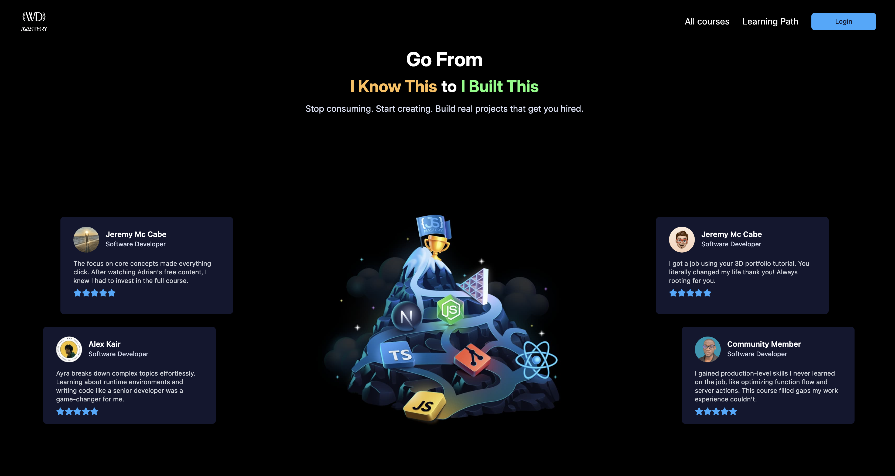

# 👩‍🏫 WD Mastery

A Learning Management web app for managing courses built with React and Tailwind CSS.

## About this project 🚀

WD Mastery is a simple **Learning Management System (LMS)** built to showcase courses along with their details and user reviews.

The website is developed using **React** and **Tailwind CSS**, with emphasis on responsive design, clean layouts, and reusable components. Building this project helped me improve my understanding of component-based architecture, UI structuring, and responsive design across different devices.

### Technologies 🛠️

- `React`
- `Tailwind CSS`

## How it looks 👀

## 🌐 Live Demo

**View Live Website:** https://wd-mastery.web.app

## Note

This website is fully responsive and works smoothly across all screen sizes.
